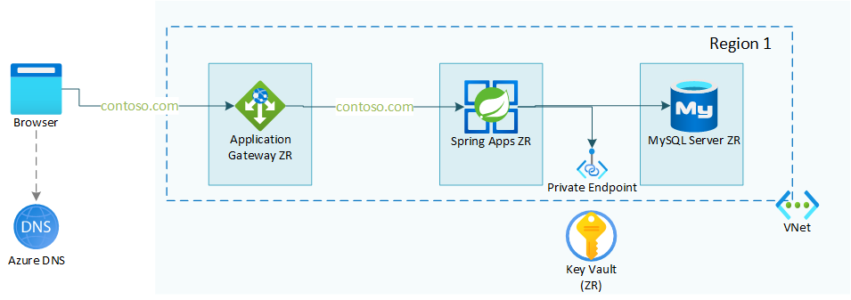

# Arquitetura de referência de várias zonas do Azure Spring Apps

Este exemplo contém um modelo Terraform que implanta um exemplo de trabalho da arquitetura de referência do centro de arquitetura do Azure: [Arquitetura de referência do Azure Spring Apps de várias zonas (em breve)] (em breve). A arquitetura de referência e o exemplo mostram como executar uma carga de trabalho do Azure Spring Apps em uma configuração de várias zonas. Isso permite maior disponibilidade da carga de trabalho.

Este exemplo também aplica uma configuração de proxy reverso adequada com [preservação do nome do host](https://learn.microsoft.com/azure/architecture/best-practices/host-name-preservation). Isso significa que os cookies e os redirecionamentos do AAD funcionarão conforme o esperado.

## Recursos

Esta estrutura de projeto fornece os seguintes recursos:

- Implantação de aplicativos Spring multizona com integração VNet;
- Configuração de proxy reverso adequada para gateway de aplicativo com um domínio personalizado;
- Integração com Key Vault;
- Integração com banco de dados MySQL Flexível.

## Começando

### Pré-requisitos

Antes de começar, verifique se você tem o seguinte disponível:

- Assinatura do Azure com acesso de Colaborador;
- Acesso ao Azure Active Directory;
- opcional:
  - certificado pfx para seu domínio personalizado;
  - Token de acesso pessoal do GitHub.

> [OBSERVAÇÃO!]
> Também existe a opção de instalar essa infraestrutura com um certificado autoassinado. Este certificado será gerado para você durante a implantação. No entanto, essa configuração deve ser usada apenas em cenários de teste.

Para implantar a infraestrutura, você pode usar um ambiente instalado localmente ou um contêiner de desenvolvimento pré-configurado.

Ao executar localmente, certifique-se de ter o seguinte instalado:

- Última versão do [Terraform](https://learn.hashicorp.com/tutorials/terraform/install-cli)
- Latest version of [AZ CLI](https://learn.microsoft.com/en-us/cli/azure/install-azure-cli)

When using the dev container, either make sure you have [GitHub Codespaces](https://docs.github.com/codespaces/overview) enabled in your GitHub organization, or you can start up the dev container locally with the [Visual Studio Code Remote Containers](https://code.visualstudio.com/docs/remote/containers) extension.

### Installation

This sample can be set up in a test or a non-test setup.

- [test set up]: In this case the Git PAT token is optional and a self-signed certificate is used. Walkthrough of this setup is found in the [install-test.md](docs/install-test.md) file.
- [non-test set up]: In this case the Git PAT token is mandatory and a pfx certificate for your custom domain is used. Walkthrough of this setup is found in the [install-prod.md](docs/install-prod.md) file.

### What you need to know about this setup

More info on how the terraform templates are build and how they operate can be found in the [docs](docs) folder of this repository. Best starting point is the [maintf.md](docs/maintf.md) file.

### Coming up

We are working on improving this sample. The ideas we have on improving:

- Create Bicep templates for the same setup (in progress)
- Make the database interchangeable for other types of databases (Cosmos DB as a first candidate)
- Currently the apps in Azure Spring Apps are based on the Spring Petclinic sample, these apps should be better configurable.

## Resources

- [Azure Architecture Center: Multi-zone Azure Spring Apps reference architecture(coming up)](article coming up)
- [Preserve the original HTTP host name between a reverse proxy and its back-end web application](https://learn.microsoft.com/azure/architecture/best-practices/host-name-preservation)
- A similar automated setup in multiple regions can be found in the [Azure Spring Apps multi region reference architecture](https://github.com/Azure-Samples/azure-spring-apps-multi-region) GitHub repository with more info in the [Deploy Azure Spring Apps to multiple regions](https://learn.microsoft.com/azure/architecture/reference-architectures/microservices/spring-apps-multi-region) architecture center article.
